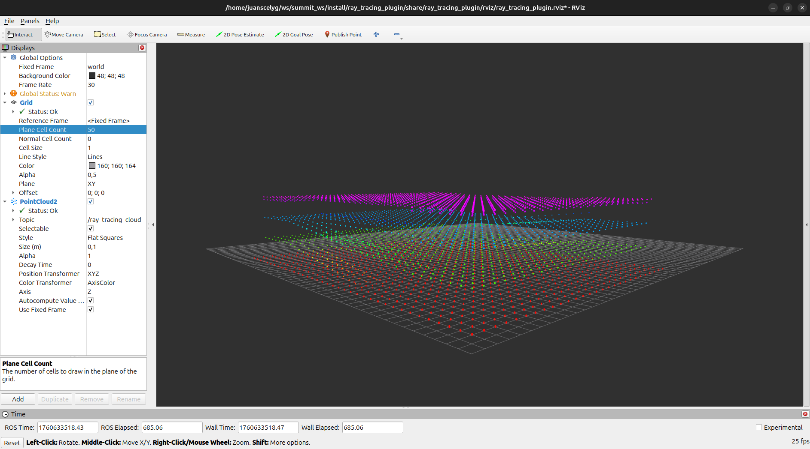

# Ray Tracing Plugin


[](https://github.com/juanscelyg/ray_tracing_plugin/actions/workflows/main.yaml)

This repository contains a **Gazebo plugin** that implements a **ray tracing system** to create a PointCloud message in Gazebo and ROS 2. It is designed to integrate with robotic simulation environments, enabling the calculation of ray intersections with objects in the virtual world.



---

## Features

- Ray Tracing using Gazebo plugin.
- Compatible with **Gazebo Jazzy**.
- Implemented in **C++** with support for configuration via **ROS 2 launch files**.
- Modular architecture:
  - **include/**: plugin headers.
  - **src/**: main source code.
  - **worlds/**: sample worlds for testing.
  - **launch/**: simulation launch files.
- Built using **colcon**.

---

## Project Structure

```bash
ray_tracing_plugin/
├── config/                       # Configuration files
├── include/ray_tracing_plugin/   # Plugin headers
├── src/                          # Source code
├── worlds/                       # Test worlds
├── launch/                       # Launch files
├── CMakeLists.txt                # Build configuration
├── package.xml                   # Package metadata
└── LICENSE                       # GPL-3.0 License
```

---

## Installation

### Prerequisites

- **Gazebo Jetty** or later.
- **ROS 2 Jazzy** (optional for integration).
- **CMake ≥ 3.20**.
- **colcon** for building.

### Steps

In your ROS 2 workspace, run the following commands:

```bash
# Clone the repository
git clone https://github.com/juanscelyg/ray_tracing_plugin.git

# Install dependencies
cd <ros2-workspace>
rosdep install --from-paths src --ignore-src -r -y

# Build
colcon build --symlink-install --packages-select ray_tracing_plugin

# Source the workspace
source install/setup.bash
```

---

## Usage

1. Launch Gazebo with a test world:

   ```bash
   gz sim worlds/test_world.sdf
   ```

2. Load the plugin into the desired model via the SDF file:

   ```xml
    <plugin
      filename="ray_tracing_plugin"  
      name="ray_tracing_plugin::PointCloudGenerator">
      <center_x>0.0</center_x>
      <center_y>0.0</center_y>
      <center_z>0.0</center_z>
      <min_scan_x>-10.0</min_scan_x>
      <min_scan_y>-10.0</min_scan_y>
      <min_scan_z>-1.0</min_scan_z>
      <max_scan_x>10.0</max_scan_x>
      <max_scan_y>10.0</max_scan_y>
      <max_scan_z>10.0</max_scan_z>
      <resolution>0.25</resolution>
      <step>3.0</step>
    </plugin>
   ```

### Parameters

All parameters are optional and have default values:

- `center_x`: X-coordinate of the scan’s center point in the simulation frame.
- `center_y`: Y-coordinate of the scan’s center point in the simulation frame.
- `center_z`: Z-coordinate of the scan’s center point in the simulation frame.
- `min_scan_x`: Minimum X boundary of the scanning region.
- `min_scan_y`: Minimum Y boundary of the scanning region.
- `min_scan_z`: Minimum Z boundary of the scanning region.
- `max_scan_x`: Maximum X boundary of the scanning region.
- `max_scan_y`: Maximum Y boundary of the scanning region.
- `max_scan_z`: Maximum Z boundary of the scanning region.
- `resolution`: Spatial resolution of the scan grid (distance between sample points) in horizontal direction.
- `step`: Incremental step for ray casting or scanning progression in vertical direction.

---

## License

This project is licensed under **GPL-3.0**. See the LICENSE file for details.

---

## Contributions

Contributions are welcome! Please open an **issue** or submit a **pull request**.
